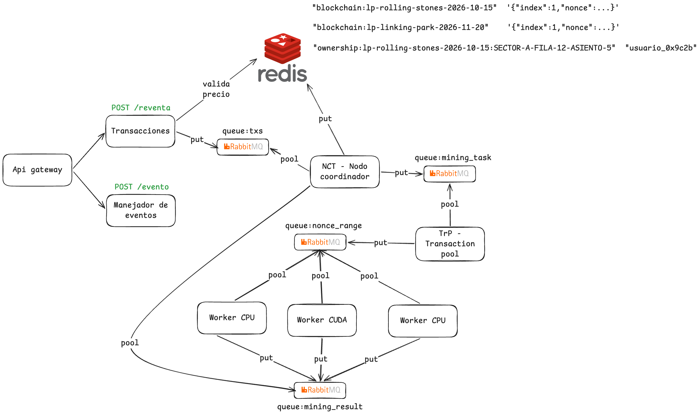

# **TicketChain**

Plataforma de Ticketing Descentralizada sobre Blockchain

**Materia:** Sistemas Distribuidos y Programación Paralela 2026

**Universidad:** Universidad Nacional de Luján — DCB

**Docente:** Dr. David Petrocelli

**Grupo:** 404

**Fecha de entrega:** 23 de junio de 2026

   
*Propuesta de Caso de Uso — Trabajo Práctico Integrador*

# **1\. Resumen Ejecutivo**

TicketChain es una plataforma descentralizada de emisión y transferencia de entradas a eventos culturales y deportivos (recitales, partidos, teatro, etc.) que utiliza una blockchain propia para registrar cada operación de forma pública, inmutable y verificable.

 

El caso de uso resuelve un problema concreto y observable: en el mercado secundario argentino de entradas no existe forma de auditar cuántas veces fue revendida una entrada, si el precio respeta topes legales, ni si el código QR en circulación fue vendido a más de un comprador. Las plataformas centralizadas actuales concentran toda la información y pueden alterar o eliminar historial sin rendición de cuentas.

 

La solución propuesta: cada entrada es una transacción en una blockchain distribuida. El historial completo de emisión y reventa es público e inmutable. Las reglas de negocio (precio máximo de reventa, cantidad de reventas permitidas, etc.) se graban en el bloque génesis y no pueden modificarse con posterioridad.

 

# **2\. Problema y Motivación**

El mercado de entradas en Argentina presenta tres fallas estructurales que TicketChain aborda directamente:

 

•         Opacidad del mercado secundario: una entrada puede circular indefinidamente entre revendedores sin registro público, imposibilitando la auditoría de precios y titularidad.

•         Doble venta: al no existir un registro único de titularidad, el mismo código QR puede entregarse a múltiples compradores. El último poseedor legítimo sólo se determina en la puerta del evento.

•         Dependencia de terceros centralizados: las plataformas actuales concentran la verificación de identidad del comprador y pueden borrar registros, modificar precios históricos o caer por fallas técnicas en picos de demanda.

 

La blockchain ofrece la propiedad técnica necesaria para solucionar estas tres fallas simultáneamente: inmutabilidad, disponibilidad distribuida y verificabilidad pública sin depender de una autoridad central.

# **3\. Concepto de Solución**

## **3.1 Modelo de transacción**

Cada operación sobre una entrada queda registrada como una transacción con la siguiente estructura:

 

`{ "from":       "productora_luna_park",`

  `"to":     	"usuario_0x4f3a",`

  `"evento_id":  "lp-rolling-stones-2026-10-15",`

  `"entrada_id": "SECTOR-A-FILA-12-ASIENTO-5",`

  `"precio": 	15000,`

  `"timestamp":  "2026-05-25T14:32:00Z" }`

 

El campo from identifica al vendedor actual; to al nuevo propietario. La productora opera como from en la venta primaria. La verificación en puerta consulta el campo to del último bloque que referencia ese entrada\_id.

 

## **3.2 Decisión arquitectónica: una cadena por evento**

Cada evento tiene su **propia blockchain** en Redis, su propio exchange en RabbitMQ y sus **propios workers** asignados. Al finalizar el evento, la cadena se archiva en cold storage.

 

•         Aislamiento total: un pico de demanda en un evento no afecta a los demás.

•         Escalabilidad horizontal por evento: se asignan más workers GPU/CPU según tráfico en tiempo real vía Kubernetes HPA.

•         Justifica el uso de exchanges separados en RabbitMQ (arquitectura híbrida cola/tópico requerida por el TP).

•         La cadena no crece indefinidamente: se archiva al cierre del evento.

 

## **3.3 Reglas de negocio configurables (bloque génesis)**

El creador del evento define sus reglas al momento de crearlo. Quedan grabadas en el bloque génesis y son inmutables desde ese instante:

 

| Parámetro | Descripción |
| ----- | ----- |
| precio\_max | Precio tope en reventas (ej: 150 % del valor original) |
| max\_reventas | Cantidad máxima de veces que una entrada puede revenderse |
| nominada | Si true, la entrada no puede transferirse a otro titular |
| ventana\_venta | Hasta cuándo se puede revender (ej: 24 h antes del evento) |

 

# **4\. Actores del Sistema**

| Actor | Responsabilidad |
| ----- | ----- |
| TicketChain | Opera la blockchain, los nodos y la infraestructura cloud |
| Creador de evento | Se registra con API key, crea eventos, define reglas, emite entradas |
| Comprador / Revendedor | Adquiere entradas en venta primaria y puede revenderlas respetando las reglas |
| Control de acceso | Valida entradas en la puerta consultando el estado actual en Redis |

 

# **5\. Ciclo de Vida de un Evento**

| Fase | Descripción |
| ----- | ----- |
| 1\. Registro | El creador se registra en la plataforma y obtiene una API key |
| 2\. Creación | Define el evento y sus reglas → se genera el bloque génesis en la blockchain |
| 3\. Emisión | N entradas emitidas como txs: productora → null (sin propietario aún) |
| 4\. Venta primaria | Usuario compra → tx: null → usuario, precio validado contra reglas |
| 5\. Reventa | Usuario revende → tx: userA → userB, precio ≤ precio\_max, reventas ≤ max\_reventas |
| 6\. Control de acceso | El validador consulta Redis para determinar el titular actual del entrada\_id |
| 7\. Cierre y archivo | La blockchain del evento se archiva en cold storage al finalizar |

 

# **6\. Arquitectura de Microservicios**

## **6.0 Diagrama de arquitectura propuesta**

## **6.1 Servicios definidos por el TP (Pilar 2\)**

| Servicio | Responsabilidad |
| ----- | ----- |
| NCT — Nodo Coordinador | Valida transacciones, forma bloques, publica tareas en RabbitMQ |
| Transaction Pool (TrP) | Fragmenta rangos de nonce entre workers, gestiona keepalives |
| Worker GPU | Minero CUDA en C/C++ — resuelve PoW con aceleración GPU |
| Worker CPU | Fallback en Python — se instancia automáticamente si no hay GPU |

 

## **6.2 Servicios adicionales de la plataforma**

| Servicio | Responsabilidad |
| ----- | ----- |
| API Gateway | Punto de entrada único, autenticación por API key, rate limiting |
| Event Registry | CRUD de creadores y eventos, genera el bloque génesis |
| Transaction API | Recibe compras y reventas, las encola para el NCT |
| Access Control API | Valida una entrada en la puerta (consulta Redis, retorna propietario actual) |
| Status API | Health check de todos los servicios en formato JSON (requerido por el TP) |

 

# **7\. Stack Tecnológico**

| Componente | Tecnología / Justificación |
| ----- | ----- |
| Minero GPU | C/C++ \+ CUDA (Hits \#2–\#7 del Pilar 1\) |
| Minero CPU (fallback) | Python con hashlib — se levanta vía HPA si no hay GPU |
| Microservicios | Python \+ FastAPI — desarrollo ágil, tipado opcional |
| Cola de mensajes | RabbitMQ — exchange por evento (hybrid queue/topic) |
| Base de datos / Blockchain | Redis con persistencia AOF — blockchain:{evento\_id} |
| Orquestación | Kubernetes en GKE — HPA para escalar workers |
| Infraestructura como código | OpenTofu — 4 pipelines de CI/CD en GitHub Actions |
| Algoritmo de hash | MD5 en TP, SHA-256 en producción |
| Mecanismo de consenso | Proof of Work (PoW) |
| Observabilidad | Prometheus \+ Grafana — métricas de throughput y latencia |

 

# **8\. Mapeo con los Pilares del TP**

## **Pilar 1 — CUDA**

•         Hit \#4–\#6: cálculo y benchmarking de MD5/SHA-256 sobre GPU.

•         Hit \#7 (hit7\_range\_miner): el binario CUDA recibe rangos de nonce por parámetro. El Worker GPU del Pilar 2 lo invoca vía subprocess; retorna RESULT:NONCE=X:HASH=Y con exit code 0 (solución encontrada) o 1 (no encontrada en el rango).

•         Cierre de etapa: tabla comparativa CPU vs GPU con distintas dificultades de prefijo (1–8 caracteres).

 

## **Pilar 2 — Infraestructura distribuida**

•         P1: el NCT valida estructura y firma de cada transacción antes de incluirla en un bloque.

•         P2: RabbitMQ distribuye tareas de minería; el TrP subdivide rangos de nonce y los asigna a workers según keepalives recibidos.

•         P3: Redis almacena la cadena blockchain:{evento\_id} con persistencia; cada bloque incluye previous\_hash, nonce, timestamp, transactions y block\_hash.

•         P4: el NCT implementa el flujo NCT.1–NCT.4 (publicación → competencia → verificación → almacenamiento).

•         P5: el TrP ajusta la dificultad (longitud de prefijo) si no hay GPU disponible, y dispara instancias CPU efímeras vía HPA.

 

## **Pilar 3 — Despliegue y pruebas**

•         Cluster GKE con nodegroup de infraestructura (Redis, RabbitMQ) y nodegroup de aplicaciones.

•         4 pipelines de CI/CD: entorno K8s → infraestructura → aplicaciones → workers GPU/CPU dinámicos.

•         Pruebas de carga: 1 a 100.000 transacciones × 8 niveles de dificultad de prefijo × 5 tamaños de fragmentación TrP.

•         Simulación de ingreso/egreso de nodos GPU para verificar el fallback automático a CPU.

•         Generación de gráficos comparativos de throughput, latencia y escalabilidad horizontal.

# **9\. Valor Diferencial del Caso de Uso**

TicketChain fue elegido como caso de uso porque maximiza la cobertura de los tres pilares del TP de forma coherente y motivada:

 

•         La resolución de PoW con CUDA es el mecanismo de seguridad real del sistema, no un ejercicio aislado. Cada bloque de transacciones requiere que un worker encuentre un nonce válido, conectando directamente el Pilar 1 con el Pilar 2\.

•         La arquitectura de una cadena por evento genera naturalmente múltiples exchanges en RabbitMQ y múltiples pools de workers, lo que permite explorar la escalabilidad horizontal que el Pilar 3 requiere evaluar.

•         El caso es verificable en producción: cualquier persona puede consultar el historial de transferencias de una entrada a través del endpoint público de la Status API o la Access Control API.

•         El dominio es familiar y localmente relevante (mercado de entradas en Argentina), facilitando la comprensión y la defensa oral del proyecto.

   
*— Grupo 404 · Universidad Nacional de Luján · 2026 —*  